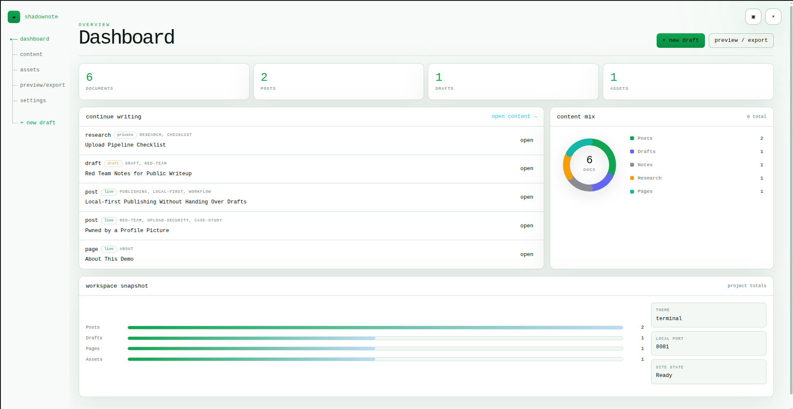
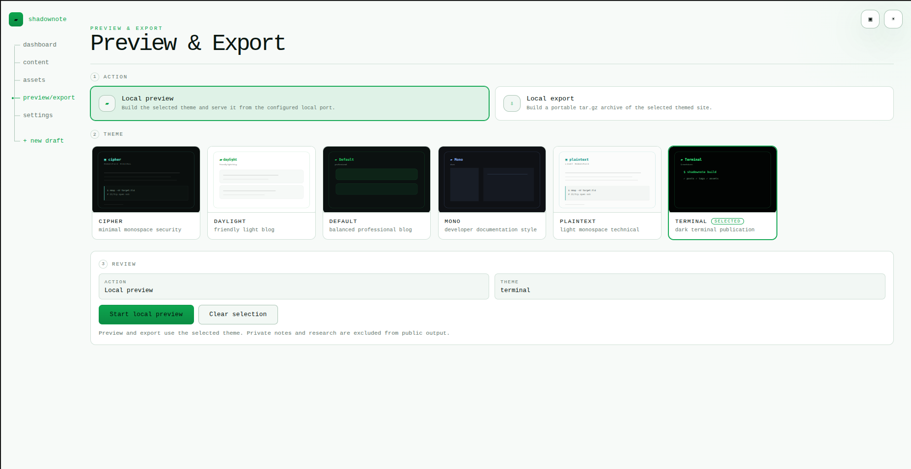

<p align="center">
  
</p>

<p align="center">
  Write, preview, and publish — LOCALY.
</p>

<p align="center">
  <a href="https://github.com/roy0x01/shadownote/actions/workflows/ci.yml"></a>
  
  <a href="LICENSE"></a>
</p>

---

ShadowNote is a local Markdown publishing tool for drafting, previewing, and exporting a static site from a browser dashboard. It can also be used as a research and note-taking workspace for drafts, notes, and reference material that may never be published. It keeps the workflow simple: write locally, manage notes and assets, preview themes, and export or deploy the static site when the content is ready.

It runs as a local dashboard on `127.0.0.1:3000`. Content is plain Markdown on disk. Search is SQLite FTS5. The binary self-contains everything — themes, templates, and the static site generator — so there is nothing to install or configure beyond the binary itself.

---

## Screenshots





---

## Install

**Pre-built binary** — grab the latest Linux amd64 build from [Releases](https://github.com/roy0x01/shadownote/releases/latest) and drop it on your `$PATH`.

**`go install`** requires a C compiler because `go-sqlite3` uses CGO:

```sh
go install -tags fts5 github.com/roy0x01/shadownote@latest
```

**Build from source:**

```sh
git clone https://github.com/roy0x01/shadownote.git
cd shadownote
go build -tags fts5 -trimpath -o shadownote .
```

> The `-tags fts5` flag enables full-text search. The build will succeed without it, but search will fall back to slower LIKE queries.

**Current release artifact:** Linux amd64. Other platforms can build from source with Go 1.22+ and a working C compiler.

---

## Quick start

```sh
shadownote
```

On first run it creates `~/.shadownote/`, extracts bundled themes and templates, and starts the dashboard. Set a password on the first login screen — that's it.

Then open `http://127.0.0.1:3000` in your browser.

---

## How it works

ShadowNote has five document types. The type determines whether a document can ever reach your public site:

| Type | Visibility |
|---|---|
| `post` | Published when `status: live` |
| `page` | Standalone pages such as About or Projects |
| `draft` | Work in progress — never published until promoted |
| `note` | Local only — never published, no matter what |
| `research` | Local only — never published, no matter what |

Notes and research are hard-excluded from the static site generator. They will not appear in any build output regardless of status.

---

## Features

**Editor**

- Markdown editor with write, split-preview, and focus modes
- Formatting toolbar for common syntax
- Live preview with shell syntax highlighting
- Word count, read time estimate, and cursor position
- Automatic version snapshot before every save — one-click restore from history

**Content library**

- Full-text search across title, body, and tags via SQLite FTS5
- Filter by type, status, and tag
- Asset manager with upload limits and active-content blocking
- Referenced-only asset publishing, so stray files never make it to the public site

**Static site generator**

- Builds post pages, paginated index, tag pages, author page, RSS feed, and sitemap
- Six bundled themes: `default`, `terminal`, `cipher`, `mono`, `plaintext`, `daylight`
- Themes live in `~/.shadownote/themes/` and are fully editable
- Mermaid diagram support is opt-in per site and loads Mermaid from a CDN when enabled

**Publishing**

- Local preview: builds the site and serves it from a local port for review before publishing
- Archive export: builds the site and writes a portable `.tar.gz` you can host anywhere

**Security**

- Dashboard binds to `127.0.0.1` — not reachable from outside your machine by default
- First-run password setup with PBKDF2-SHA256
- Raw HTML disabled in Markdown preview and published rendering by default
- SVG, HTML, and XML asset uploads blocked — active content cannot be uploaded through the asset manager
- Document version history means a bad edit is never permanent

---

## Themes

Six themes ship with the binary. They render differently enough to fit distinct publishing contexts — a personal security blog reads differently than a research notebook or a professional portfolio.

| Theme | Character |
|---|---|
| `default` | Clean, readable, general purpose |
| `terminal` | Monospace, dark, code-forward |
| `cipher` | Minimal dark with accent colour |
| `mono` | Strict monospace throughout |
| `plaintext` | No decoration, maximum readability |
| `daylight` | Light mode, soft contrast |

To create a custom theme, copy any existing one and edit the HTML layouts and CSS:

```sh
cp -r ~/.shadownote/themes/terminal ~/.shadownote/themes/mytheme
```

A valid theme needs `layouts/base.html`, `layouts/post.html`, `layouts/list.html`, `layouts/tags.html`, `layouts/author.html`, and `assets/blog.css`. It appears in the Preview & Export picker immediately.

---

## Commands

```sh
shadownote           # start the dashboard (default)
shadownote gui       # start the dashboard explicitly
shadownote build     # build the static site headlessly
shadownote deploy    # build and run local preview or export archive
shadownote version   # print version
```

Override the default database path with `SHADOWNOTE_DB`:

```sh
SHADOWNOTE_DB=/path/to/shadownote.db shadownote
```

Default data paths:

```text
~/.shadownote/shadownote.db     SQLite database
~/.shadownote/themes/           bundled themes, editable
~/.shadownote/templates/        document starter templates
~/.shadownote/content/          your Markdown documents
~/.shadownote/assets/           uploaded assets
~/.shadownote/public/           generated static site output
~/.shadownote/logs/             application logs
```

---

## Runtime data

Everything lives under `~/.shadownote/` — database, content, assets, generated output, themes, and logs. Nothing is stored remotely. Moving or backing up your entire ShadowNote data is a single directory copy:

```sh
cp -r ~/.shadownote ~/shadownote-backup
```

Override the database path with `SHADOWNOTE_DB` if you need the database elsewhere. Content, assets, and output paths can be changed from the Settings page.

---

## License

MIT — see [LICENSE](LICENSE).
